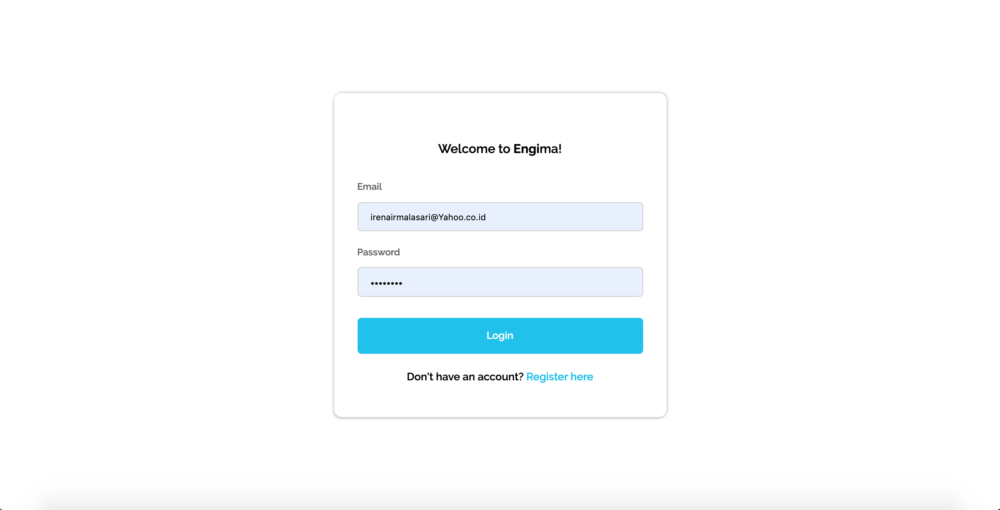
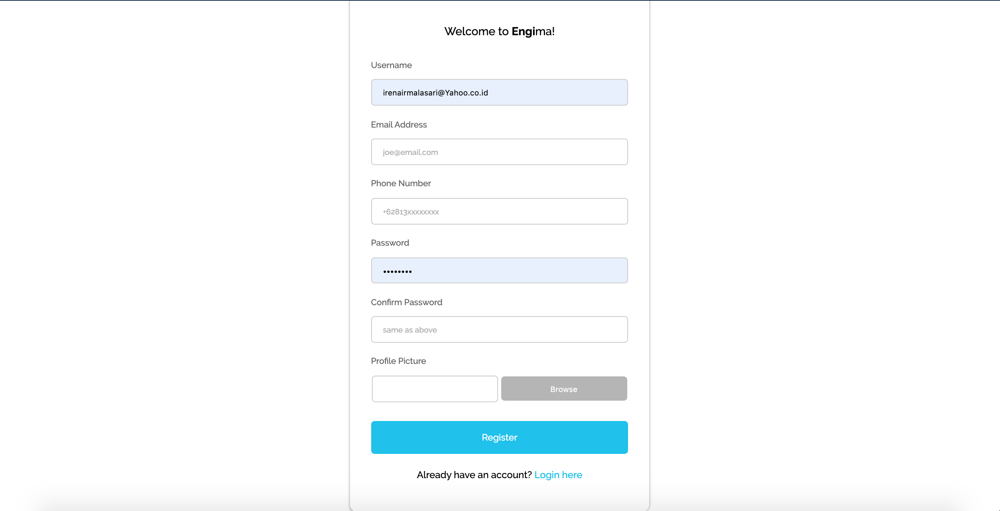
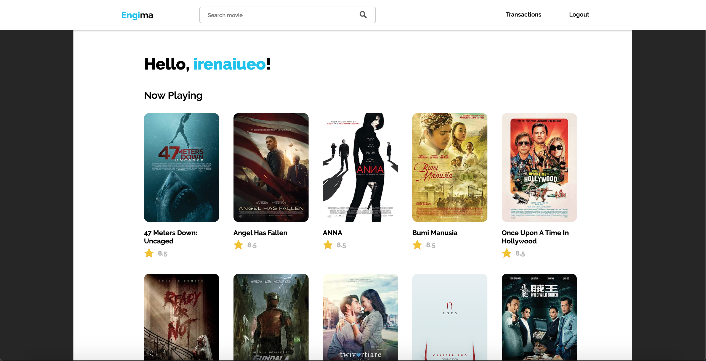
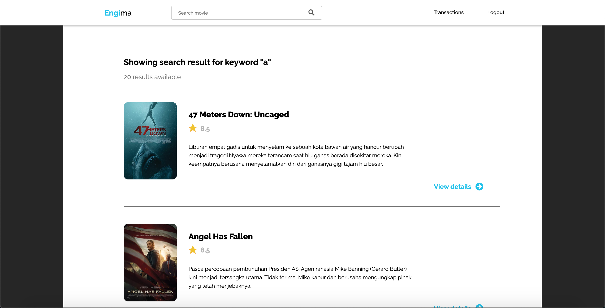
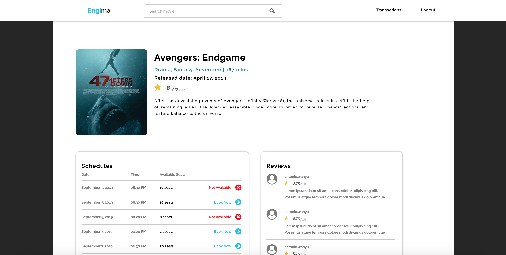
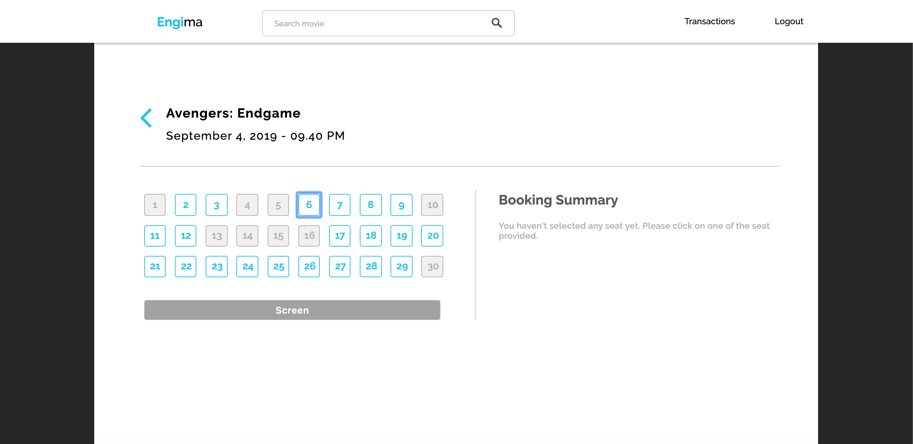

# Tugas 1 IF3110 Pengembangan Aplikasi Berbasis Web

## Deskripsi Singkat Aplikasi

Saat ini Engi ingin melakukan ekspansi usaha dengan membangun sebuah bioskop dan kami diminta untuk membuat aplikasi web pemesanan tiket bioskop daring. Engi menginginkan website miliknya untuk memiliki fitur pembelian tiket, memberi ulasan pada film yang telah ditonton, login dan register, riwayat pembelian tiket. Kami diminta untuk mengimplementasikan tampilan sedemikian mirip dengan tampilan pada contoh. Website yang dibangun tidak harus responsive, juga icon dan jenis font tidak harus sama dengan contoh. Tetapi tata letak elemen, warna font, garis pemisah, perbedaan ukuran font, format rating dan waktu harus terlihat sesuai contoh. 

Aplikasi dibuat dengan menggunakan Javascript, HTML dan CSS untuk frontend tanpa menggunakan library atau framework lainnya. Sementara untuk backend, diwajibkan menggunakan **PHP tanpa framework apapun** dan menggunakan MySQL untuk menyimpan data.

## Daftar Requirement
1. Menggunakan PHP/XAMPP/Apache/EngineX
2. Browser seperti Google Chrome, Safari
3. Mengunduh jslint dan phpcs

## Cara Instalasi
1. Membuka dua terminal/command prompt
2. Arahkan kedua terminal ke tempat menyimpan file. Satu terminal diarahkan ke folder backend, sementara yang satunya lagi diarahkan ke folder frontend
3. Ketikkan perintah "php -S localhost:3000" pada terminal yang terarah ke folder frontend
4. Ketikkan perintah "php -S localhost:8080" pada terminal yang terarah ke folder backend
5. Buka browser
6. Ketikkan alamat url localhost:3000 di browser

## Screenshot tampilan
Login

Register

Home

Search Result

Film Detail

Buy Ticket

Transaction History

User Review

# Pembagian Tugas

## ReactJS (App Bank Pro)
- Login (Irena 13517100, Arnold 13517022)
- Halaman Utama (Syaiful 13517139, Irena 13517100)
- Melakukan Transfer (Arnold 13517022, Syaiful 13517139)
- Melihat Riwayat Transaksi (Irena 13517100, Arnold 13517022)

## SOAP (WS Bank)
- Fungsi validasi no. Rek (Syaiful 13517139, Irena 13517100)
- Fungsi get data rek nasabah (Arnold 13517022, Syaiful 13517139)
- Fungsi transaksi transfer (Irena 13517100, Arnold 13517022)
- Fungsi make virtual account (Syaiful 13517139, Irena 13517100)
- Fungsi cek transaksi kredit (Arnold 13517022, Syaiful 13517139)
- Basis data bank (Irena 13517100, Arnold 13517022)

## REST (WS Transaksi)
- Fungsi add transaksi baru (Syaiful 13517139, Irena 13517100)
- Fungsi ubah status transaksi (Arnold 13517022, Syaiful 13517139)
- Fungsi get all data transaksi user (Irena 13517100, Arnold 13517022)
- Basis data transaksi tiket (Syaiful 13517139, Irena 13517100)

## Perubahan Engima
- Basis data TheMovieDB (Arnold 13517022, Syaiful 13517139)
- Home (Irena 13517100, Arnold 13517022)
- Film Details (Syaiful 13517139, Irena 13517100)
- Buy Ticket (Arnold 13517022, Syaiful 13517139)
- Transaction History (Irena 13517100, Arnold 13517022)
- Basis data Engima (Syaiful 13517139, Irena 13517022)